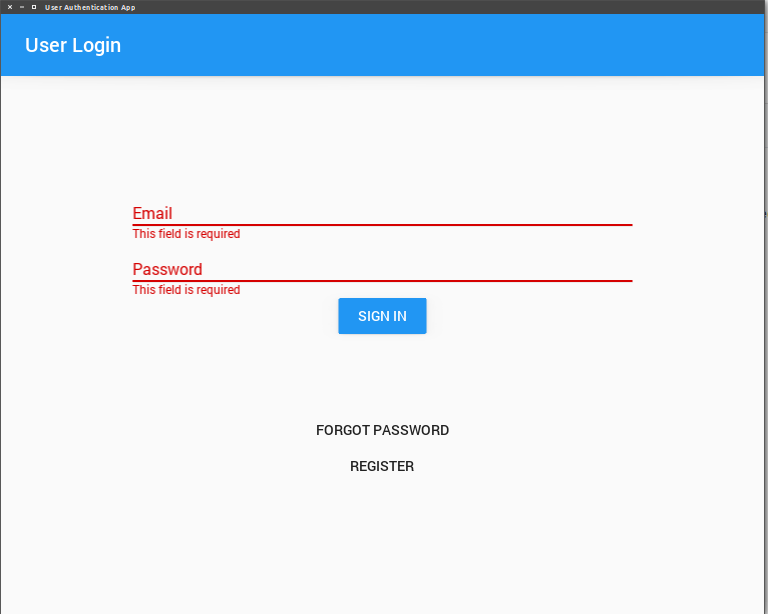
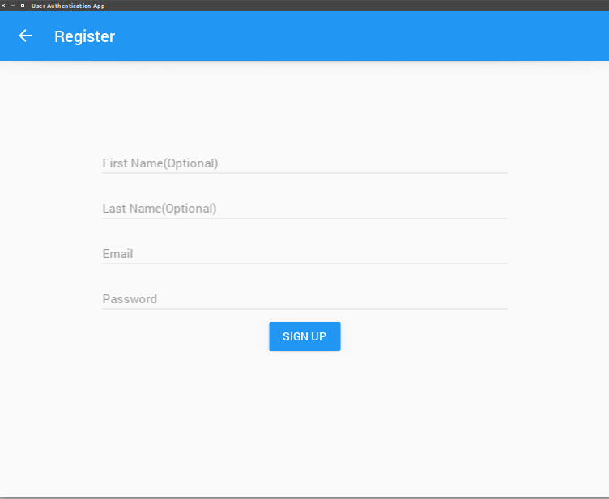

#  User Registration And Login KIVY App with DJango Backend

A simple User authentication KIVY App that can be Ported to Android and iOS which involves user login/logout, registration, email confirmation and password reset

Using Django Backend(Django RestFUL APIs)

